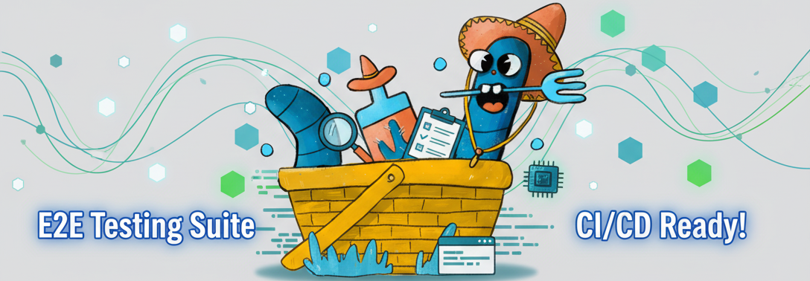

# End-to-End Tests for Taqasta



This directory contains end-to-end (e2e) tests for the Taqasta MediaWiki Docker stack, built using [Playwright](https://playwright.dev/). These tests verify that a MediaWiki installation is working correctly after deployment.

## Overview

The e2e tests are designed to validate the complete MediaWiki installation and configuration by simulating real user interactions in a browser environment. The tests cover:

- **Installation verification**: Confirms MediaWiki is properly installed
- **User interface elements**: Verifies login, signup, and navigation links
- **Skin and editor functionality**: Tests default skin and visual editor availability
- **API endpoints**: Validates API accessibility
- **Special pages**: Checks version information and software components
- **File uploads**: Tests upload functionality
- **User management**: Validates account creation and admin features

## Test Structure

### Test Files

- **`001-base.spec.ts`**: Basic functionality tests (installation, login/signup links, skin, editors)
- **`002-edit.spec.ts`**: Page editing and visual editor functionality
- **`003-upload.spec.ts`**: File upload capabilities
- **`004-admin.spec.ts`**: Administrative features and user management
- **`005-createaccount.spec.ts`**: User account creation process

### Configuration Files

- **`playwright.config.ts`**: Playwright test configuration with browser settings, timeouts, and reporting
- **`LocalSettings.php`**: MediaWiki configuration specifically for e2e testing
- **`package.json`**: Node.js dependencies and scripts
- **`Dockerfile`**: Docker container setup for running tests

### Test Fixtures

- **`fixtures/`**: Test assets like sample images for upload testing

## Prerequisites

- Docker and Docker Compose
- Node.js 22+ (for local development)
- Access to the main Taqasta application

## Running Tests

### Option 1: Using Docker Compose (Recommended)

The easiest way to run e2e tests is through Docker Compose, which handles all dependencies automatically:

```bash
# Start the full stack including the e2e test container
docker-compose --profile e2elocal up -d

# Run the tests
docker-compose exec e2e npx playwright test

# View test results (if configured)
docker-compose exec e2e npx playwright show-report --host 0.0.0.0
```

The test reports will be available at `http://localhost:9323` when using the Docker setup.

### Option 2: Local Development

For development and debugging:

```bash
# Install dependencies
npm install

# Install Playwright browsers
npx playwright install chromium --with-deps

# Start a local MediaWiki instance (ensure it's running on localhost:8000)

# Run tests
npx playwright test

# Run tests in headed mode (visible browser)
npx playwright test --headed

# Run specific test file
npx playwright test 001-base.spec.ts

# View test results
npx playwright show-report
```

## Configuration

### Environment Variables

The tests adapt their configuration based on the environment:

- **`TAQASTA_E2E_IN_DOCKER=true`**: When running in Docker, uses internal networking (`http://web:80/`)
- Default: Uses `http://localhost:8000` for local development

### Browser Configuration

Tests run on Chromium by default with the following settings:
- **Navigation timeout**: 60 seconds
- **Test timeout**: 5 minutes
- **Global timeout**: 60 minutes
- **Screenshots**: Captured only on failure
- **Traces**: Retained on failure for debugging

## MediaWiki Test Configuration

The `LocalSettings.php` file contains MediaWiki-specific settings for testing:

- Enables uploads for anonymous users
- Loads essential extensions (ParserFunctions, Scribunto, VisualEditor)
- Configures Vector skin as default
- Disables beta welcome popup for VisualEditor
- Sets up cache and security settings appropriate for testing

## Debugging

### Viewing Test Results

After running tests, you can view detailed results:

```bash
npx playwright show-report
```

### Running Tests in Debug Mode

```bash
# Run with browser visible
npx playwright test --headed

# Run with debugging enabled
npx playwright test --debug

# Run a specific test with step-by-step debugging
npx playwright test 001-base.spec.ts --debug
```

## Test Coverage

The current test suite covers:

* ✅ MediaWiki installation verification
* ✅ User authentication UI elements
* ✅ Default skin (Vector) functionality
* ✅ Visual Editor availability
* ✅ Anonymous editing capabilities
* ✅ Special pages (Version, API)
* ✅ File upload functionality
* ✅ User account creation
* ✅ Administrative features

## Adding New Tests

When adding new test files:

1. Follow the naming convention: `NNN-description.spec.ts`
2. Use descriptive test names
3. Include appropriate assertions
4. Add comments for complex test logic
5. Update this README if adding new test categories

## CI/CD Integration

These e2e tests are **fully integrated** into Taqasta's GitHub Actions CI/CD pipeline as a **mandatory quality gate**. The tests automatically run against every code change and **must pass** before Docker images are built and deployed.

### Key Integration Points

- **Automatic Execution**: Tests run on every push, pull request, and tag
- **Quality Gate**: Build pipeline stops if e2e tests fail
- **Multi-Platform Testing**: Validates both AMD64 and ARM64 architectures
- **Failure Reporting**: Detailed screenshots and reports uploaded to GitHub Pages
- **Environment Consistency**: Same Docker setup used locally and in CI/CD

### CI/CD Test Environment

When running in CI/CD, the tests use:
- **Base URL**: `http://web:80/` (internal Docker networking)
- **Database**: MySQL 8.0 container
- **MediaWiki**: Pre-configured with test-specific LocalSettings.php
- **Browser**: Chromium in headless mode
- **Timeout**: 5 minutes per test, 60 minutes total

For detailed information about the CI/CD pipeline structure, quality assurance flow, and debugging CI/CD failures, see the main [`README.md`](../README.md#ci/cd-pipeline).
