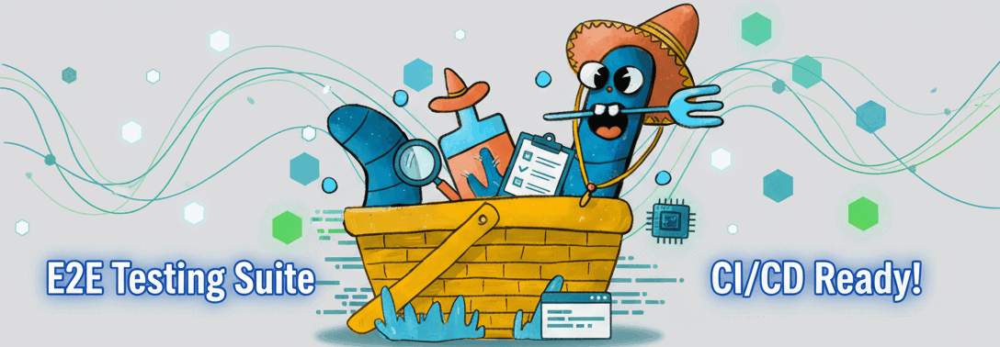

# End-to-End Tests for Taqasta

<p align="center"></p>

Taqasta has basic end-to-end integration tests set up using [Playwright](https://playwright.dev/). These tests verify that a MediaWiki installation is working correctly after deployment.

Locally, tests run inside the e2e Docker container rather than on the host to reduce npm supply-chain risk — see [Protect yourself from npm](https://timotijhof.net/posts/2019/protect-yourself-from-npm/). In GitHub Actions CI, Playwright runs on the runner against `http://localhost:8000` while the web stack runs in Docker Compose.

## Overview

Other than the `/e2e` folder in Taqasta, the following files are only for use by end-to-end tests:

- [.env.ci](../.env.ci)
- [docker-compose.yml](../docker-compose.yml)

Within the `/e2e` folder, the actual tests live in the `tests/` directory. The `fixtures/` directory holds static files used by tests (for example, `Example.jpg` for upload tests). The [LocalSettings.php](LocalSettings.php) file is used for configuring the wiki that the tests run on.

The e2e tests are designed to validate the complete MediaWiki installation and configuration by simulating real user interactions in a browser environment. The tests cover:

- Confirms MediaWiki is properly installed
- Verifies login, signup, and navigation links
- Tests default skin and visual editor availability
- Validates API accessibility
- Checks version information and software components
- Tests file upload functionality
- Validates account creation and admin features

In GitHub Actions, the tests are run in the `deploy-e2e` job of the `docker-image.yml` workflow. In short:

- build the image
- copy `.env.ci` to `.env`
- start containers
- run the tests (`npx playwright test`)
- stop the containers

Failures will be uploaded to [wikiteq.github.io/Taqasta](https://wikiteq.github.io/Taqasta/).

## Test Structure

### Test Files

Test specs live in the **`tests/`** subdirectory. When running Playwright (e.g. from the e2e container), use paths like `tests/001-base.spec.ts`.

- `tests/001-base.spec.ts` — basic functionality (installation, login/signup links, skin, editors)
- `tests/002-edit.spec.ts` — page editing and visual editor
- `tests/003-upload.spec.ts` — file upload capabilities
- `tests/004-admin.spec.ts` — admin features and user management
- `tests/005-createaccount.spec.ts` — user account creation

### Configuration Files

- `playwright.config.ts` — browser settings, timeouts, and reporting
- [LocalSettings.php](LocalSettings.php) — MediaWiki config for e2e testing
- `package.json` — Node dependencies and scripts
- `Dockerfile` — container setup for running tests

## Running Tests

### Option 1: Using Docker Compose (Recommended)

The easiest way to run e2e tests is through Docker Compose, which handles all dependencies automatically.

#### Prerequisites

- Docker and Docker Compose
- BuildKit enabled (`export DOCKER_BUILDKIT=1`)
- Git (for cloning extensions during build)

The end-to-end tests can also be run locally. To avoid running npm scripts directly on our machines, another docker container is used. After copying [.env.ci](../.env.ci) to `.env`, add `COMPOSE_PROFILES=e2elocal` to the environment before starting the containers (or use `docker compose --profile e2elocal`).

```bash
# Enable BuildKit for advanced Docker features (required)
export DOCKER_BUILDKIT=1

# Compile the Dockerfile template
./compile.sh

# Copy CI env defaults for local compose
cp .env.ci .env

# Start the full stack including the e2e test container
docker compose --profile e2elocal up -d

# Wait for the web (Taqasta) container to be healthy, then run the tests
docker compose exec e2e npx playwright test

# View test results (run report server, then open http://localhost:9323)
docker compose exec e2e npx playwright show-report --host 0.0.0.0
```

**Note**: BuildKit must be enabled for the Docker build process. If you encounter build errors, ensure `DOCKER_BUILDKIT=1` is set.

### Option 2: Development and debugging

For developing or debugging tests, use the same Docker setup: run Taqasta with the `e2elocal` profile (which starts the web stack plus a Node container with Playwright). Then run tests inside the e2e container:

```bash
# From repo root: ensure stack is up and web is healthy, then:
docker compose exec e2e npx playwright test

# Run a single test file
docker compose exec e2e npx playwright test tests/001-base.spec.ts

# Run with browser visible (headed) or step-through debug
docker compose exec e2e npx playwright test --headed
docker compose exec e2e npx playwright test tests/001-base.spec.ts --debug

# Open a shell in the e2e container to run ad-hoc commands
docker compose exec e2e sh
```

## Configuration

### Environment Variables

The tests adapt their configuration based on the environment:

- Default (CI and host runs): base URL is `http://localhost:8000` (from [.env.ci](../.env.ci))
- `TAQASTA_E2E_IN_DOCKER=true` (local e2e container only): base URL is `http://web:80/`

### Browser Configuration

Tests run on Chromium by default with the following settings:

- Navigation timeout: 60 seconds
- Test timeout: 5 minutes
- Global timeout: 60 minutes
- Screenshots captured only on failure
- Traces retained on failure for debugging

## MediaWiki Test Configuration

The [LocalSettings.php](LocalSettings.php) file contains MediaWiki-specific settings for testing:

- Enables uploads for anonymous users
- Loads essential extensions (ParserFunctions, Scribunto, VisualEditor)
- Configures Vector skin as default
- Disables beta welcome popup for VisualEditor
- Sets up cache and security settings appropriate for testing

## Debugging

### Viewing Test Results

After running tests, view the report from inside the e2e container:

```bash
docker compose exec e2e npx playwright show-report --host 0.0.0.0
```

Then open http://localhost:9323 in your browser.

### Running Tests in Debug Mode

```bash
# Run with browser visible
docker compose exec e2e npx playwright test --headed

# Run with step-through debugging
docker compose exec e2e npx playwright test tests/001-base.spec.ts --debug
```

## Test Coverage

The current test suite covers:

* ✅ MediaWiki installation verification
* ✅ User authentication UI elements
* ✅ Default skin (Vector) functionality
* ✅ Visual Editor availability
* ✅ Anonymous editing capabilities
* ✅ Special pages (Version, API)
* ✅ File upload functionality
* ✅ User account creation
* ✅ Administrative features

## Adding tests

More tests are helpful — tests should go under `tests/` and work both locally and in GitHub CI. Refer to the [Playwright documentation](https://playwright.dev/docs/writing-tests) for details on creating tests.

When adding new test files:

1. Follow the naming convention: `NNN-description.spec.ts`
2. Use descriptive test names
3. Include appropriate assertions
4. Add comments for complex test logic
5. Update this README if adding new test categories

## CI/CD Integration

These e2e tests are **fully integrated** into Taqasta's GitHub Actions CI/CD pipeline as a **mandatory quality gate**. The tests automatically run against every code change and **must pass** before multi-platform images are pushed to the registry.

### Key Integration Points

- Tests run on every push, pull request, and tag
- Build pipeline stops if e2e tests fail
- E2E runs against the AMD64 (x86_64) image build
- Playwright test reports (and screenshots) uploaded to GitHub Pages when tests fail — browse at [wikiteq.github.io/Taqasta](https://wikiteq.github.io/Taqasta/)

### CI/CD Test Environment

In CI, Playwright runs on the GitHub Actions runner (not inside the e2e container). The web stack still runs in Docker Compose; the runner reaches it at `http://localhost:8000` (port published from `.env.ci`). Locally, when you use `docker compose exec e2e`, the e2e container sets `TAQASTA_E2E_IN_DOCKER=true` and uses `http://web:80/` instead.

Both environments use:

- MySQL 8.0 database container
- MediaWiki with test-specific LocalSettings.php
- Chromium in headless mode
- 5 minutes per test, 60 minutes total

For detailed information about the CI/CD pipeline structure, quality assurance flow, and debugging CI/CD failures, see the main [README.md](../README.md#quality-assurance-and-cicd).

## Troubleshooting

### Docker Compose Build Issues

#### BuildKit Not Enabled

Error: `the --mount option requires BuildKit`
Solution: Enable BuildKit before running Docker Compose:

```bash
export DOCKER_BUILDKIT=1
docker compose --profile e2elocal up -d
```

To make this permanent, add `DOCKER_BUILDKIT=1` to your shell profile (`.bashrc`, `.zshrc`, etc.).

#### Missing Dockerfile

Error: `unable to prepare context: unable to evaluate symlinks in Dockerfile path: lstat .../Dockerfile: no such file or directory` (or similar, with your repo path)
Solution: Compile the Dockerfile template first:

```bash
./compile.sh
docker compose --profile e2elocal up -d
```

### Tests fail or connection errors

#### Connection refused / page not loading

Error: `page.goto: net::ERR_CONNECTION_REFUSED` or similar when running tests in the e2e container.

Solution: The web (Taqasta) container may not be ready yet. Wait for it to be healthy after `docker compose --profile e2elocal up -d` (e.g. 30–60 seconds), or check with `docker compose ps` and ensure the web service is healthy before running `docker compose exec e2e npx playwright test`.
